#### Step 1: Preparation of sample 

•	Collect the sand sample in the container and click on Next to proceed. 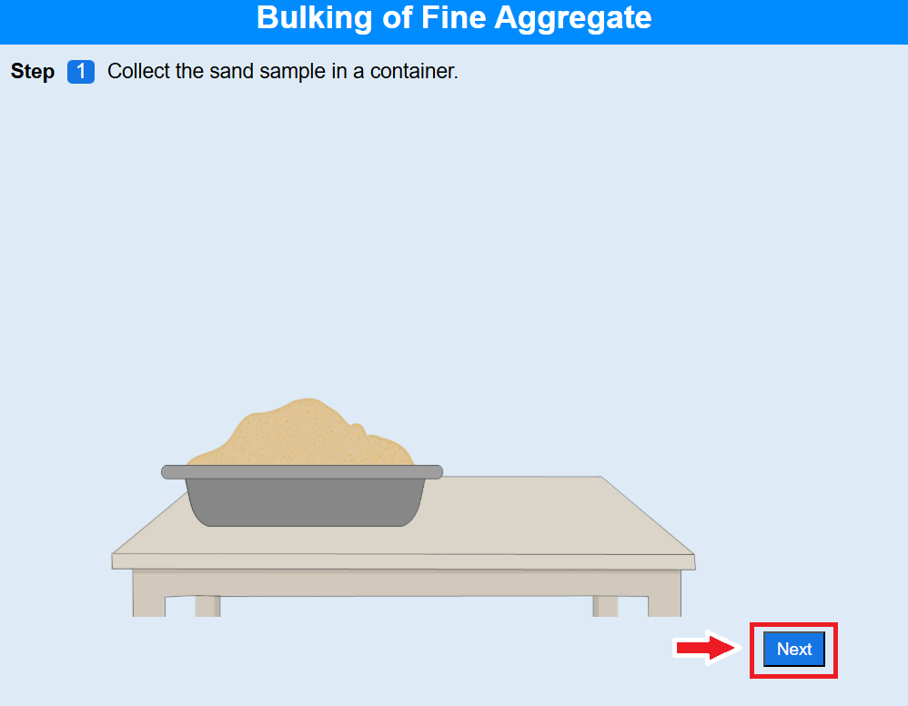 

• Click on the trowel to take the sand and cement in the ratio 3:1 by weight to make standard mortar.
 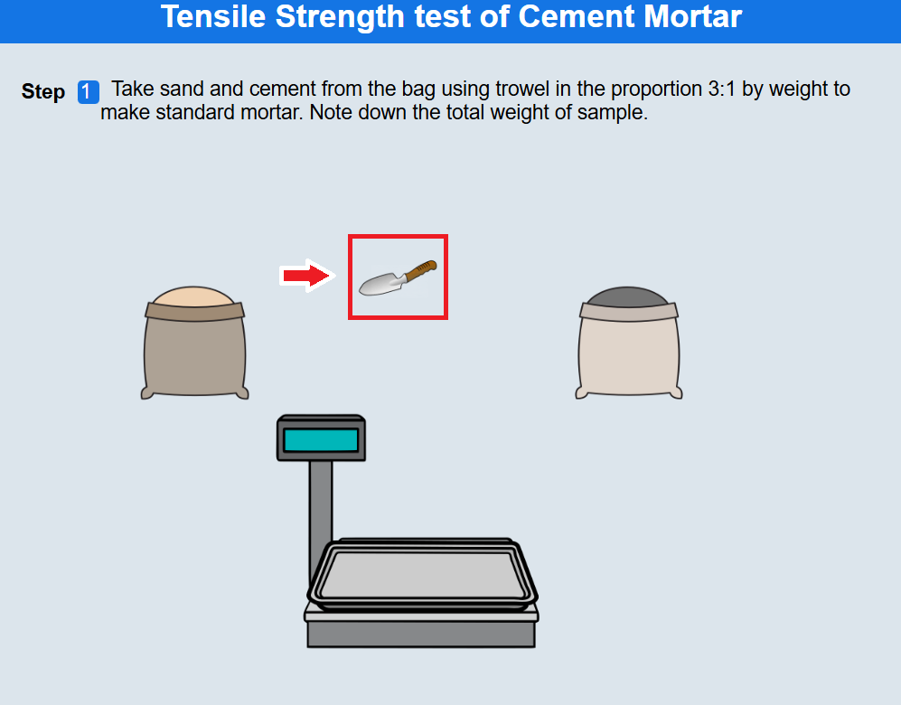 

• Click on Next to proceed. 

#### Step 2: Preparation of sand and cement mixture.  

• Click on the tray to pour it in the vessel and mix it.  

• Click on Next to proceed. 

#### Step 3: Preparation of mortar mix 

• Weigh the empty flask by clicking on the beaker. 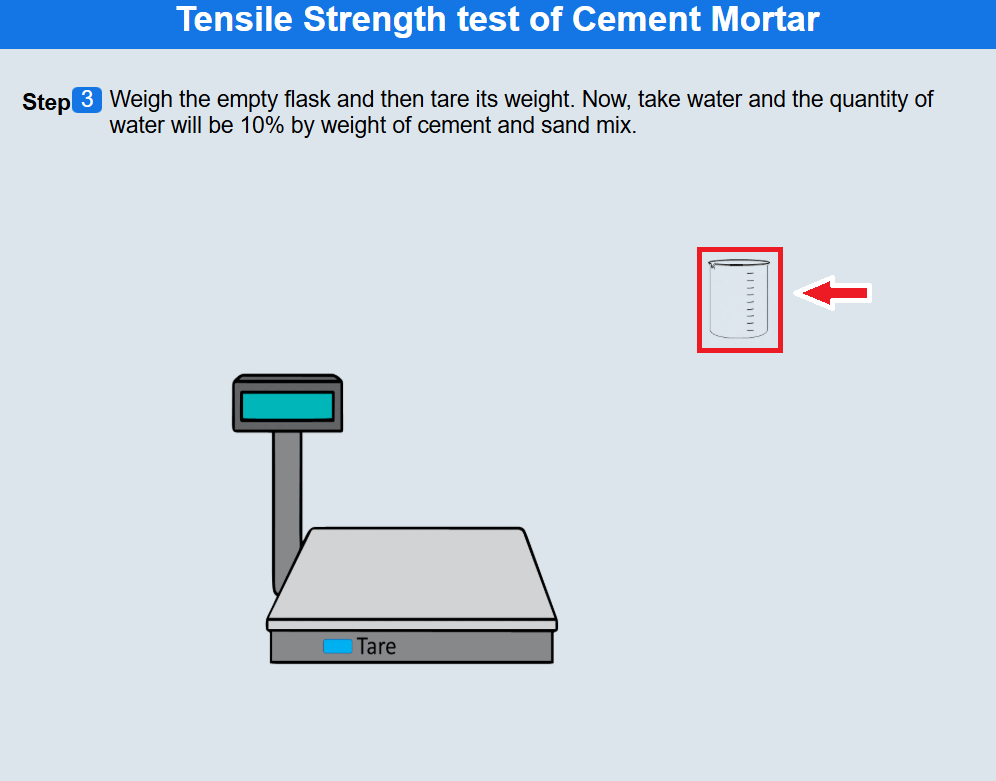 

• Click on the tare button to set the weight to zero. 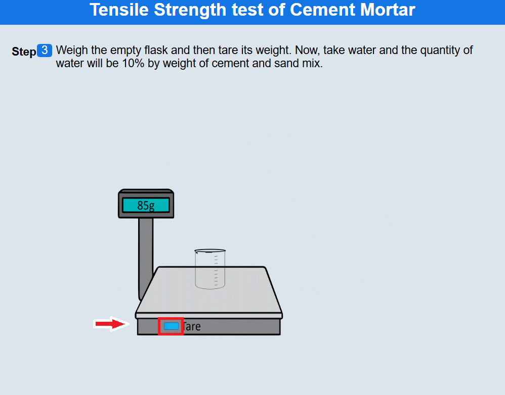 

• Click on the measuring cylinder to measure the quantity of water that is 10% by weight of cement and sand mix. 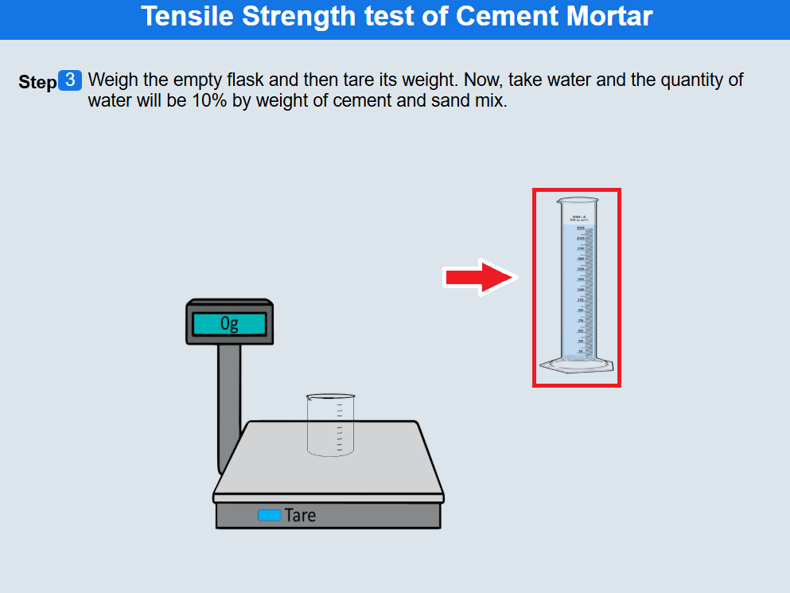 

• Click on the beaker to add water to the cement-sand mix.  

• Click on the trowel to prepare the mortar mix.   

• Click on Next to proceed. 

#### Step 4: Preparation of mould

• Click on the briquette mould to place it on bottom plate. 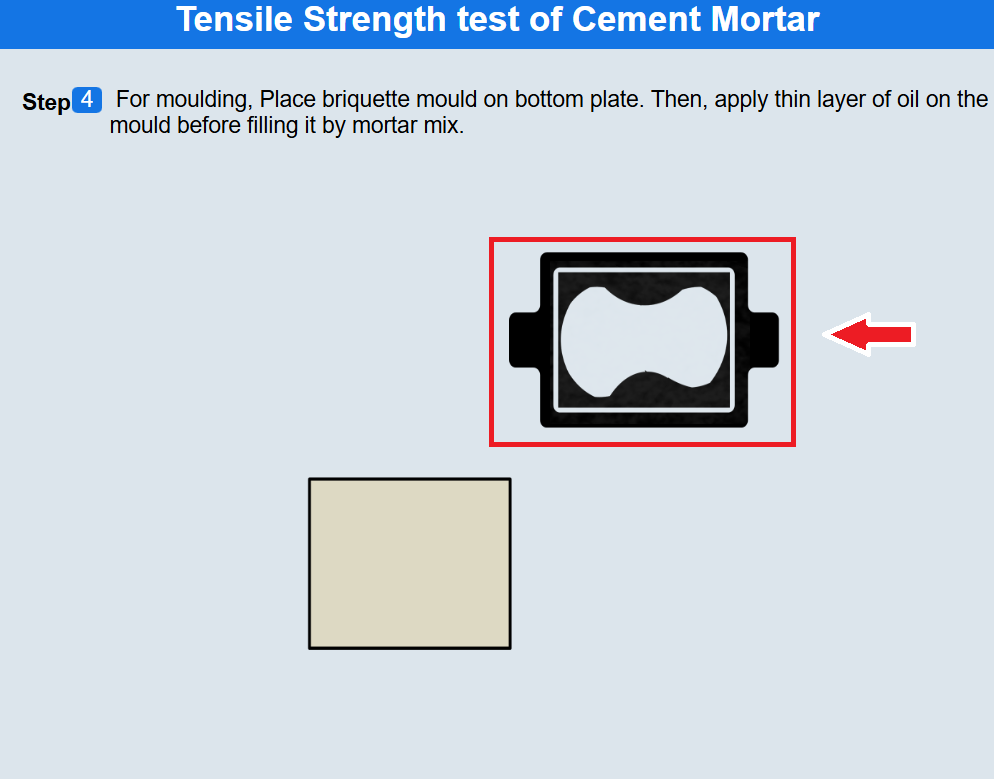 

• Click on the brush to apply thin layer of oil.  

• Click on the trowel and fill the mortar mix in briquette moulds.  

• Click on the rammer to compact the mortar mix. 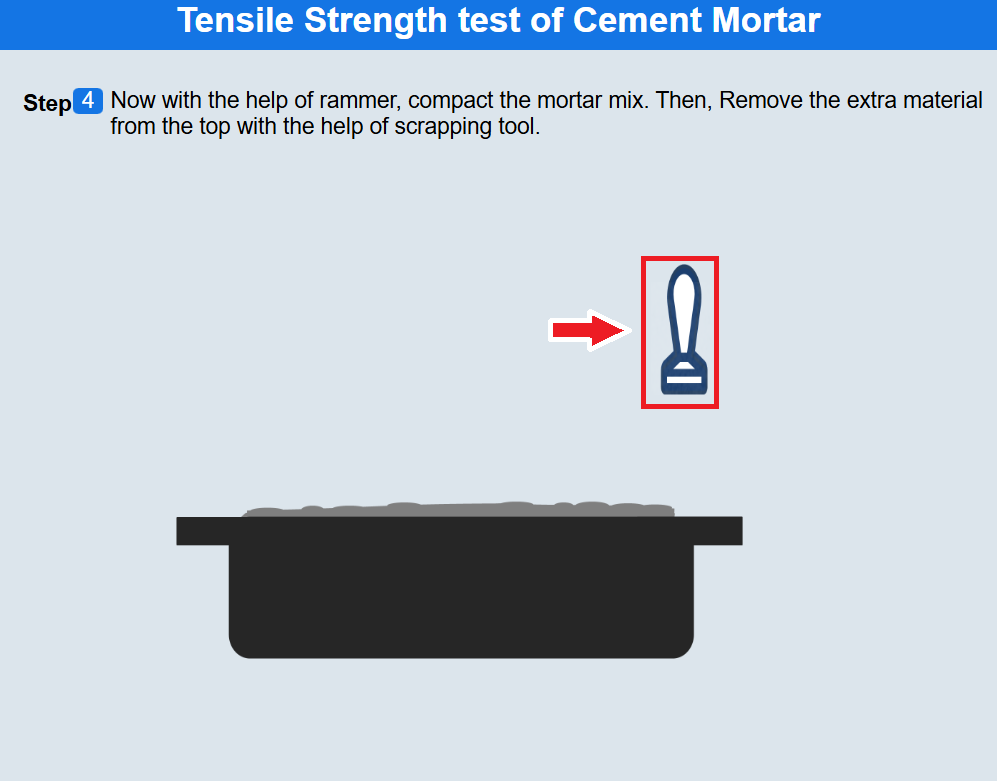 

• Click on the scrapping tool and remove the extra material from the top of the mould.  

• Click on the brush to apply mineral oil on the metal plate. 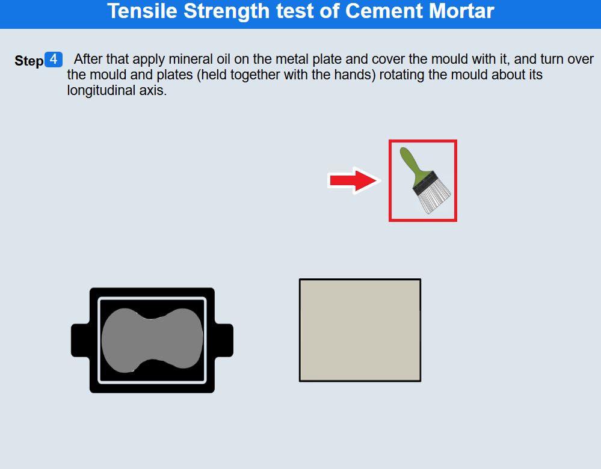 

• Click on the metal plate to cover the mould with it.   

• Click on the mould to rotate the mould about its longitudnal axis.  

• Click on Next to proceed.  

#### Step 5: Preparation of briquette for testing

• Enter the date of mould on the briquette and click on submit. Place all the test specimen in the Lime Water Tank for the respective ages.
 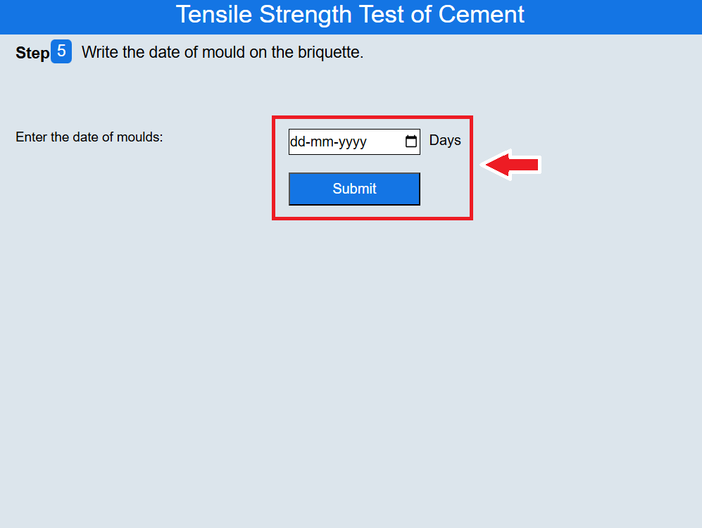 

• Take out three specimens from the Lime Water Tank one by one by clicking on them.
 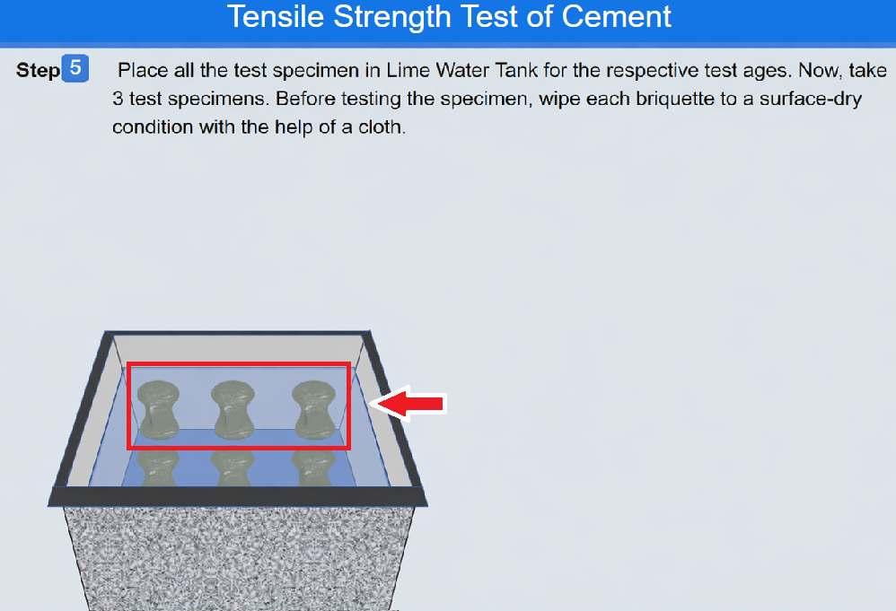 

• Click on the cloth to wipe the briquettes to a surface dry condition. 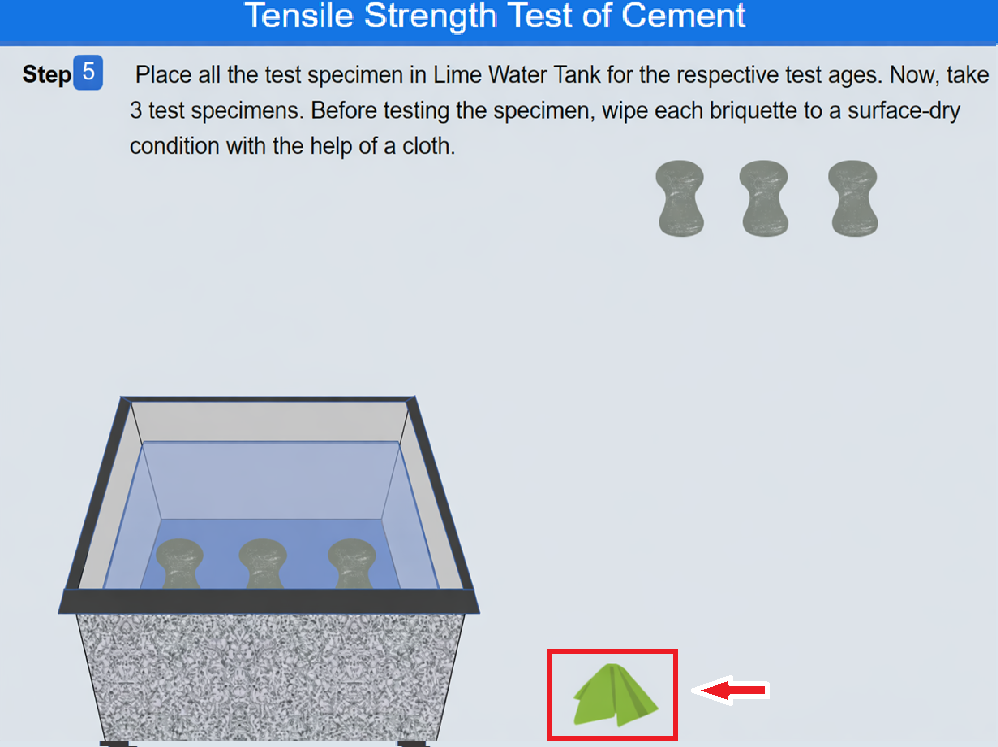 

• Click on Next to proceed. 

#### Step 6: Tensile strength testing

• Now , click on the sample to place them on the briquette tensile testing machine. 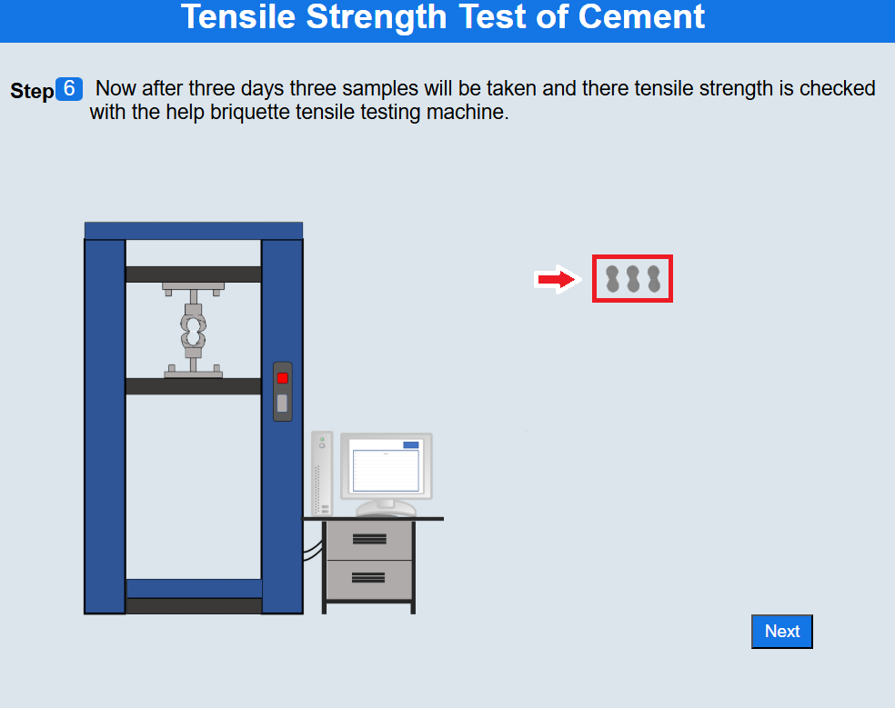 

• Click on the monitor to input the amount of strength to be used by the machine. 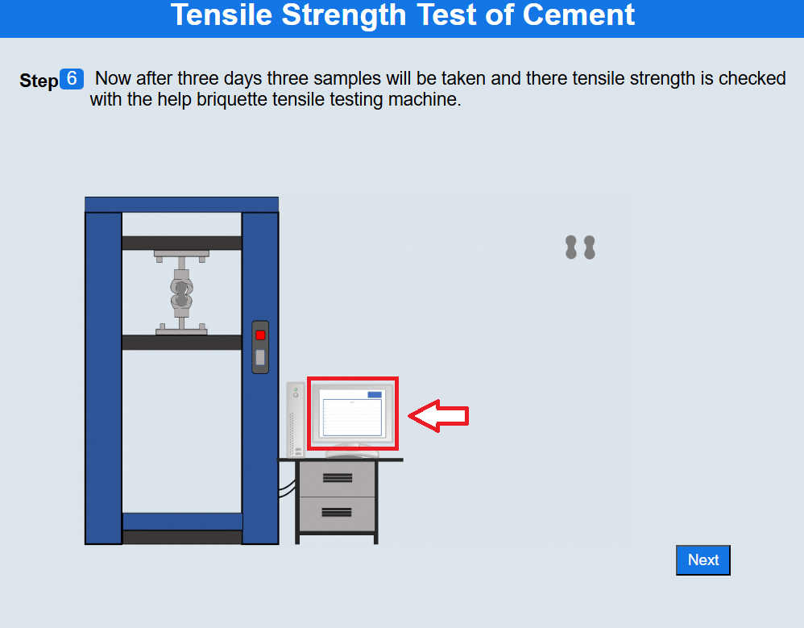 

• Similarly repeat the procedure with test specimen 2 and 3. 
• Click on Show Result for the results. 
